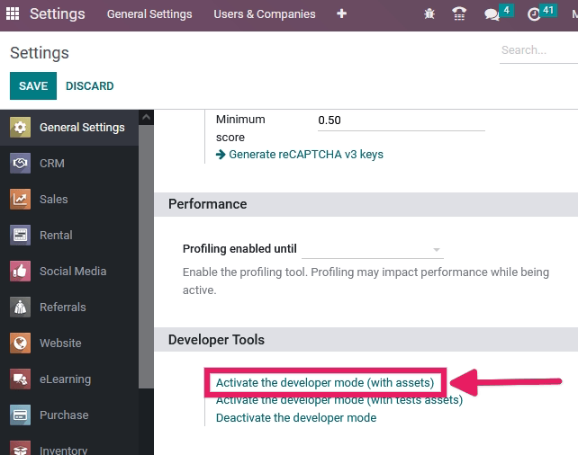
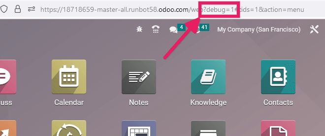
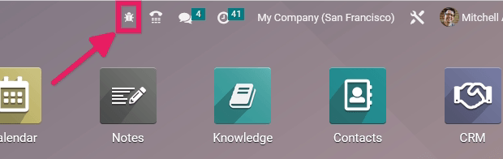

(developer-mode)=
#  Developer Mode (Debug Mode)

The developer mode (or debug mode) unlocks access to extra and advanced tools in OpenSPP. There are several ways to activate the developer mode: through the Settings or the URL.

## Activate through the settings

The debug mode can be activated in the OpenSPP database settings. Go to **Settings → General Settings → Developer Tools** and click on **Activate the developer mode**. At least one application needs to be installed for the **Developer Tools** section to appear in the **Settings** module.



```{note}
*Activate the developer mode (with assets)* is used by developers; *Activate the developer mode (with tests assets)* is used by developers and testers.
```
Once activated, the *Deactivate the developer mode* option becomes available.

## Activate through the URL

The debug mode can also be activated by adding an extra query string to the database's URL. In the URL, add `?debug=1` or `?debug=true` after `/web`. To deactivate the debug mode, change the value to `?debug=0` instead.



```{tip}
Additional modes are available for developers: `?debug=assets` enables the [assets mode](#frontendframeworkassets_debug_mode), and `?debug=tests` enables the [tests mode](#frontendframeworktests_debug_mode).
```
## Locate the developer mode tools
-------------------------------

Once developer mode is activated, the developer mode tools can be accessed from the *Open Developer Tools* button, the bug icon located in the header of the Odoo database.



This menu has extra tools that are useful to understand or edit technical data, such as the views or actions of a page. On a page that has filters, actions, and view options, the developer mode tools contain some useful menu items such as:

- *Edit Action*
- *Manage Filters*
- Edit the current view (for example, Kanban, List, Graph, etc.)
- See the *Fields View Get*

```{note}
This page is adapted from the Odoo documentation on {ref}`odoo:developer-mode`.
```