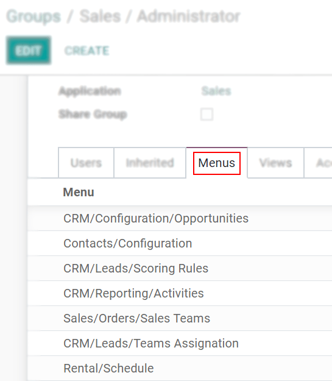

# Access Management

## Introduction

User Access Management is a key component of OpenSPP that enables program administrators to control and manage user access to the platform's features and data. With OpenSPP's role-based access control system, administrators can define different levels of access for individual users or groups, ensuring that only authorized users have access to specific data and features.

There are different dimensions to access rights in OpenSPP, including access to specific application features and access to specific data or subsets of data (for example, data related to a specific location). By defining these access rights, administrators can ensure that users are able to perform their roles and responsibilities effectively while minimizing the risk of data breaches or unauthorized access.

This user guide provides step-by-step instructions on how to manage user access in OpenSPP, including how to create and manage user accounts, assign roles and permissions, and customize user access rights. By the end of this guide, you should have a solid understanding of how to effectively manage user access in OpenSPP to ensure the security and integrity of your social protection program data.


## User management

OpenSPP defines a **user** as someone who has access to a database to perform daily tasks. You can add
as many users as you need and, to restrict the type of information each user can access,
rules can be applied. Users and access rights can be added and changed at any point.

(users/add-individual)=
### Add individual users

Go to **Settings → Manage Users** and click on **Create**.

```{figure} access_management/manage-users.png
:align: center
:height: 280
:alt: View of the settings page emphasizing the manage users field in OpenSPP
```

- Fill in the form with the necessary information. Under the tab {ref}`access_rights` choose the group within each application the user can have access to.
- The list of applications shown is based on the applications installed on the database.

```{figure} access_management/new_user.png
:align: center
:alt: View of a user’s form emphasizing the access rights tab in OpenSPP
```

When you are done editing the page and have **Saved** it, an invitation email is automatically sent to the user. The user must click on it to accept the invitation and create a login.

```{figure} access_management/invitation-email.png
:align: center
:alt: View of a user’s form with a notification that the invitation email has been sent in OpenSPP
```

With the {ref}`developer-mode` activated, **User Types** can be selected.

```{figure} access_management/user-type.png
:align: center
:height: 300
:alt: View of a user’s form in developer mode emphasizing the user type field in OpenSPP
```

The **Portal** and **Public** options don't allow you to choose access rights. Members have specific ones (such as record rules and restricted menus) and usually don't belong to the usual OpenSPP groups.

(access-rights)=
## Access rights

Activate the {ref}`developer-mode`, then go to **Settings -> Users & Companies -> Groups**.

### Groups

When choosing the groups the user can have access under Access Rights, details of the rules and inheritances of that group aren't shown, so this is when the menu *Groups* comes along. *Groups* are created to define rules to models within an application.
Under *Users*, have a list of the current ones. The ones with administrative rights are shown in black.


*Inherited* means that users added to this application group are automatically added to the following ones. In the example below, users who have access to the group *Administrator* of *Sales* also have access to *Website/Restricted Editor* and *Sales/User: All Documents*.


```{note}
Remember to always test the settings being changed in order to ensure that they are being applied to the needed and right users.
```

The *Menus* tab is where you define which menus (models) the user can have access to.



*Access Rights* rules are the first level of rights. The field is composed of the object name, which is the technical name given to a model. For each model, enable the following options as appropriate:

- *Read*: the values of that object can be only seen by the user.
- *Write*: the values of that object can be edited by the user.
- *Create*: values for that object can be created by the user.
- *Delete*: the values of that object can be deleted by the user.


As a second layer of editing and visibility rules, *Record Rules* can be formed. They overwrite, or refine, the *Access Rights*.
A record rule is written using a *Domain*. Domains are conditions used to filter or searching data. Therefore, a domain expression is a list of conditions. For each rule, choose among the following options: *Read*, *Write*, *Create* and *Delete* values.


```{note}
Making changes in access rights can have a big impact on the database. For this reason, we recommend you to contact your OpenSPP Business Analyst or our Support Team, unless you have knowledge about Domains in OpenSPP.
```

```{note}
This page is adapted from the Odoo documentation.
```